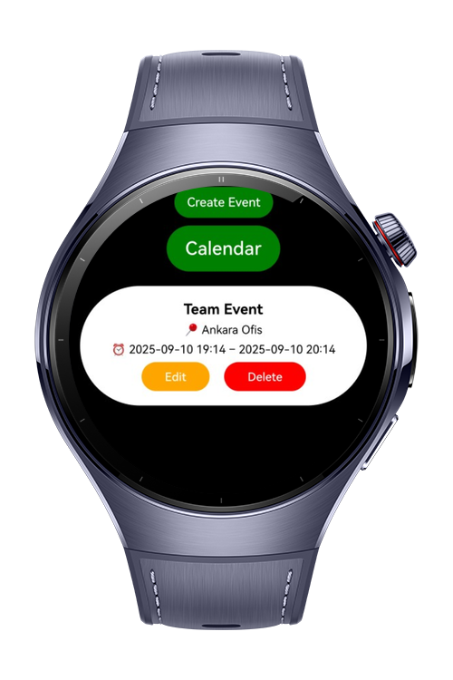
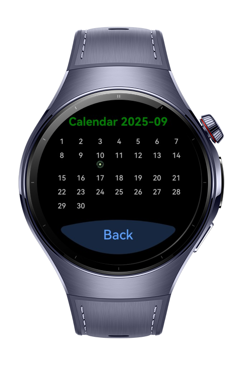
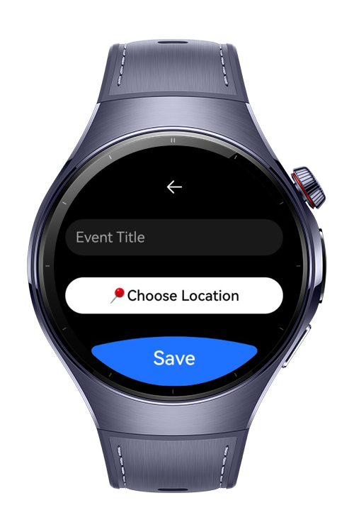
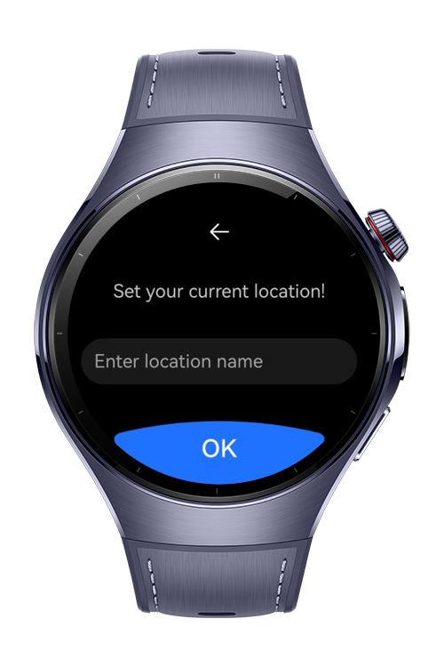

> **Note:** To access all shared projects, get information about environment setup, and view other guides, please visit [Explore-In-HMOS-Wearable Index](https://github.com/Explore-In-HMOS-Wearable/hmos-index).

# GeoSchedule

GeoScheduleApp is a smart event management app built with ArkTS and ArkUI, optimized for HarmonyOS smart devices. It allows users to create events by capturing their current location, save them directly to the calendar, and view all created events in both a list and calendar view for easy organization.

# Preview





# Use Cases

- Create Event with Current Location: Users can create a new event that automatically includes their current location details.

- Save Event to Calendar: Created events are stored directly in the app calendar for seamless scheduling.

- View Events in List Format: Users can browse all created events in a scrollable list for quick access and management.

- Display Events in Calendar View: Events are visually displayed in the calendar interface, helping users track schedules by date.

- Handle Errors Gracefully: The app uses BusinessError handling to provide clear feedback when event creation or saving fails.

# Tech Stack

- Languages: ArkTS (Ark TypeScript)

- Frameworks: HarmonyOS SDK 5.1.0 (API Version 18)

- Tools: DevEco Studio Version 5.1.0.842

- Libraries & Kits:
 	- @kit.CalendarKit – Used to create, save, and manage calendar events.

	- @kit.LocationKit – Provides APIs to get the current device location.

	- @kit.BasicServicesKit – Supplies BusinessError for handling exceptions and service errors.

	- @kit.ArkUI – UI framework for building interactive and responsive HarmonyOS interfaces.
    
 ---

# Project Directory
```
|---model
|   |---EventModel.ets        # Data model representing a calendar event
|   |---LocationModel.ets     # Data model for storing location details

|---pages
|   |---CalendarPage.ets      # Page showing all events in calendar view
|   |---EventPage.ets         # Page for creating and editing events
|   |---Index.ets             # Entry point for routing and initialization
|   |---LocationPage.ets      # Page for selecting or confirming location
|   |---MainPage.ets          # Main screen displaying event list

|---service
|   |---NavigationService.ets # Handles navigation logic across app pages

|---util
|   |---Constants.ets         # Application constants and configuration values

```
# Constraints and Restrictions

## Supported Devices

- Huawei Watch 5
- Devices running HarmonyOS 5.1.0 (API 18) and above

---


# Licence

GeoSchedule is distributed under the terms of the MIT License
See the [LICENSE](./LICENSE) for more information.
